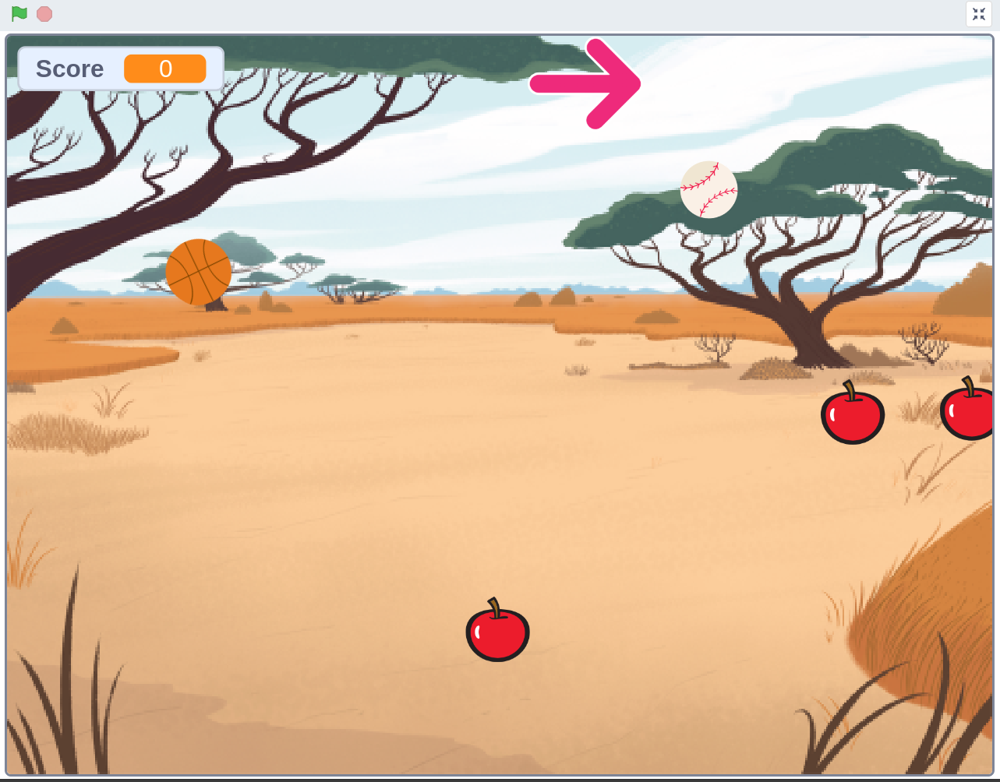

# scratch

## Description

This is a scratch game.

Use top, bottom, left, right arrow keys to control the arrow.

- When the arrow hits the baseball or the basketball, the score will decrease by 1.
- When the arrow hits the apple, the score will increase by 1.
- When the arrow hits the beachball, the score will increase by 100.
- The game will end when the score is less than 0.

## Check list

- Your project must use at least two sprites, at least one of which must not be a cat.
- Your project must have at least three scripts total (i.e., not necessarily three per sprite).
- Your project must use at least one conditional, at least one loop, and at least one variable.
- Your project must use at least one custom block that you have made yourself (via Make a Block), which must take at least one input.

